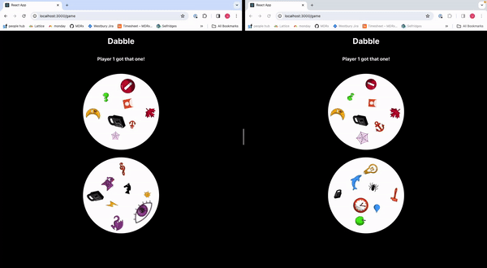

# dabble

Dabbling in Dobble: a web app implementation of the card game Dobble.

Each player has an individual card, with the shared card at the top of the screen. Simulate picking up a card by clicking on matching symbols:



## Structure

`/server` holds code for a node.js websocket server that handles connections for multiple players
`/webapp` holds code for a React app for client connections

## Run

Install packages for all directories with:

```bash
npm install
```

First ensure the IP in webapp/.env is pointing at the IP for the webserver. You can then start both servers from the root directory with:

```bash
npm run start
```
